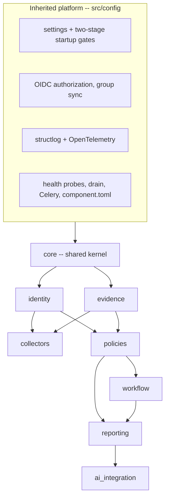
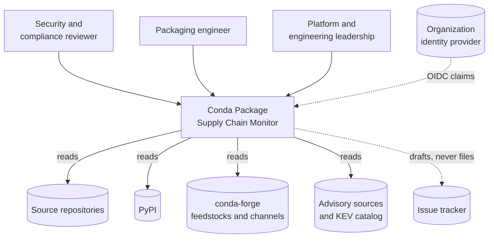
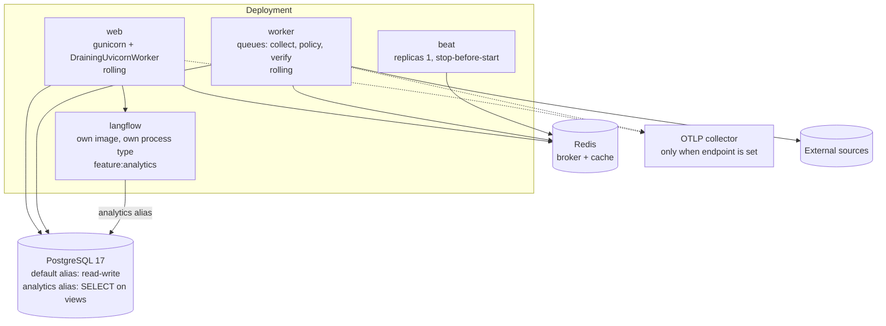
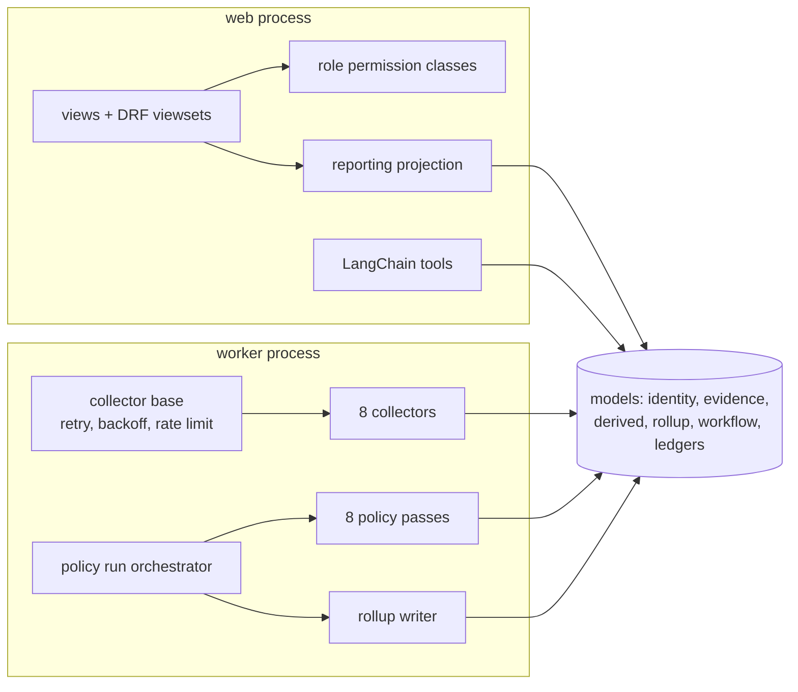
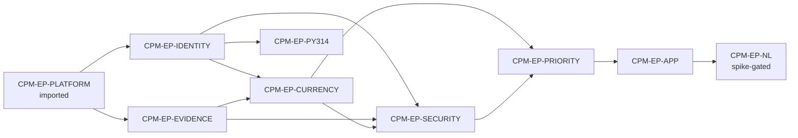

# Solution Design — Conda Package Supply Chain Monitor

This document explains the architecture. `ARCHITECTURE-SPINE.md` is the contract — 24
numbered rules a build must obey, deliberately stripped of reasoning. This is the
reasoning: why the shape is what it is, what each layer owns, and how a real collection
run and a real user request move through it.

Read the spine to know what you must do. Read this to know why, and to onboard.

---

## 1. The problem shapes the architecture

Three properties of the problem drive almost every decision here.

**The system's job is to be believed.** A supply-chain monitor that says "clean" is
making a claim someone will act on — or fail to act on. The expensive failure is not a
missed CVE; it is a package that shows clean because a lookup failed, a mapping was never
resolved, or evidence went stale unnoticed. That is why "unknown is not clean" is not a
nice-to-have but the thing the data model is built around, and why the counter-metric
`CPM-SM-C1` explicitly names *rising clean percentage* as the primary failure mode.

**Every answer must be reconstructable.** Someone will ask, months later, why a package
was flagged — or why it wasn't. That question is unanswerable if the system overwrites
what it knew. So observations are never updated, only appended, and every derived
conclusion records the policy version and evidence cut-off that produced it.

**The inputs are unreliable and unrelated to each other.** Ten thousand packages
observed across source repositories, PyPI, conda-forge, advisory databases and a KEV
catalog — each with its own availability, rate limits and outage schedule. Any design
where one source's failure blocks another's is wrong on the first bad afternoon.

Those three give you the paradigm.

---

## 2. Why pipes-and-filters over an append-only log

The collectors are **filters**: independent, single-purpose, idempotent, sharing nothing.
The evidence log is the **pipe** — the only thing they have in common.

The alternative most teams reach for is a service that fetches everything about a package
and writes a consolidated row. It is simpler for one package and wrong at ten thousand:
the slowest, flakiest source sets the pace for all of them, a partial result has nowhere
to live, and "when did we last successfully check PyPI for this package?" has no answer.

Splitting into filters costs a join and buys three things:

- **Independent failure.** The advisory collector being rate-limited has no bearing on
  feedstock currency. `CPM-AD-7` forbids a collector from importing or reading another,
  so the isolation cannot erode over time.
- **Independent cadence.** Security sweeps daily, version currency daily-to-weekly,
  Python 3.14 build verification only on demand. Cadence is scheduler data
  (`CPM-AD-20`), not a property of the code.
- **Replay.** Because evidence is a log and policy is a separate pass, a policy change
  can be re-run over history without touching the network. That is what makes
  `CPM-FR-22` ("re-run a version against a cut-off, reproduce identical results")
  achievable at all.

The cost is real: two writes where one would do, and a rollup step to keep reads fast.
That rollup is `CPM-AD-11`, and it is where most of the subtlety lives.

---

## 3. The layers, and what each one owns



**Platform (`src/config/`) — inherited, not ours.** Configuration, the two-stage startup
refusal gates, OIDC authentication and group-claim sync, structured logging and tracing,
health and drain endpoints, the Celery app, and the `component.toml` deployment contract.
The product does not reimplement any of it. Critically, it also does not *modify* it: the
platform's contributable-settings allowlist forbids a domain app from touching
authentication backends, permission classes or middleware.

**`core` — the shared kernel.** The things that must be defined exactly once or the
layers above will diverge: the `OutcomeState` type and its precedence order
(`CPM-AD-5`), the append-only base model, the run-ledger models, the role permission
classes, and the collector base carrying retry, backoff, timeout and rate limiting. If
two apps would otherwise each invent something, it belongs here.

**`identity` — who a package is.** One mutable row per package: canonical name,
cross-ecosystem mappings, provenance, confidence. Nothing else. Not a version, not a
score, not a status. This is the strictest boundary in the design and the one most likely
to be violated under deadline pressure, because the PRD's export contract *looks* like a
table definition. It isn't (`CPM-AD-1`).

**`evidence` — what we observed, and when.** Append-only, one table per kind of
observation, every row carrying its source and `observed_at`. Nothing updates. Nothing
deletes.

**`collectors` — the filters.** One per source. Each writes its own evidence table and
its own run-ledger row, reads only `identity`, and computes no status.

**`policies` — the deterministic passes.** Everything derived is computed here: currency,
vulnerability and KEV rollups, license, Python 3.14 readiness, feedstock presence,
remediation readiness, priority, score, work type. Rule content is versioned *data*, so a
policy change is a data change with a version bump, not a deployment.

**`workflow` — what humans decided.** All three queues, one table, keyed on a stable
finding key. Separate from evidence because a human decision is not an observation, and
separate from identity because it is not who the package is.

**`reporting` — the surfaces.** Views, API, exports, and the governed views the analytics
layer reads. It projects; it does not compute.

**`ai_integration` — the leaf.** LangChain tools over governed views. Holds no write
grant, reaches no table directly, and asserts no conclusion policy did not produce.

---

## 4. C4 views

### Level 1 — System context



The system reads from every external source and writes to none. The one outbound
artifact is a drafted tracking issue a human files (`CPM-UJ-2`) — v1 detects, it does not
remediate.

### Level 2 — Containers



`beat` is `replicas = 1` with `stop-before-start` replacement because two schedulers
would double-fire every cadence. `web` and `worker` roll. LangFlow is a separate image
precisely so its dependency pins never have to reconcile with this component's.

### Level 3 — Components inside the Django application



---

## 5. How a collection run actually flows

Beat fires a **collection run**, not a collector. For each package in scope:

1. The collector base creates a run-ledger row with status `running` — **before** the
   first outbound call. This is the whole reason run ledgers are exempt from the
   append-only rule (`CPM-AD-2`): if the worker is killed mid-call, the row survives
   showing `running`, and the coverage view can ask "what started and never finished."
   An append-only ledger written only at the end would leave nothing at all, exactly when
   it matters most.
2. If a successful run for this collector and package already exists inside the
   configured **observation window**, the run records `skipped` and stops. A manually
   triggered recollection always bypasses the window — otherwise the "trigger a
   recollection" affordance in `CPM-UJ-1` would silently do nothing.
3. The outbound call runs under the base's timeout, rate limit and retry-with-backoff.
4. The result is **inserted** — never updated, never deduplicated by a unique constraint.
   `observed_at` is the moment of this observation. A failure inserts an evidence row
   carrying `error` or `not_found`; it does not skip writing.
5. The ledger row is finalized in a `finally`, carrying the trace id of the task.

The transaction boundary is **one package** (`CPM-AD-23`). A failure at package 9,000
never rolls back the first 8,999, the run reports `partial`, and no transaction is held
open for the length of a rate-limited sweep.

### Then the policy run

Beat separately fires a **policy run** with one cut-off — the `finished_at` of a
completed collection run, never `now()`, so no pass ever reads evidence from a sweep
still in flight.

The run executes its passes in declared order. Each writes only its **own** per-domain
derived table, keyed `(package, policy_run)`. A later pass may read an earlier pass's
output — the priority pass reads the vulnerability rollup rather than re-deriving
severity, which is what stops the health view and the priority bucket from disagreeing.

Then a **single writer** composes the rollup: one full-row replace per package, in one
transaction, stamped with the run id, the cut-off and a per-domain version map. Exactly
one row per inventory package, always — including `unmapped` ones, whose gated statuses
are written as `unknown` rather than the row being skipped.

This is the part that is easy to get wrong. Two passes each doing
`update_or_create` on the rollup is ordinary Django and completely broken: the second
resets the first's columns to their defaults, so a determinate security finding silently
becomes `unknown`. `CPM-AD-21` exists to make that unbuildable.

---

## 6. How a request flows

```mermaid
sequenceDiagram
  actor Reviewer
  participant Web
  participant DB
  participant Queue
  Reviewer->>Web: open the work queue
  Web->>Web: OIDC session; group claims -> role
  Web->>DB: read rollup (paginated) + workflow items
  DB-->>Web: rows + computed_at + policy versions
  Web-->>Reviewer: queue, ranked bucket then score
  Reviewer->>Web: advance an item
  Web->>DB: lock row, check prior state, write transition + audit (one transaction)
  Reviewer->>Web: trigger a recollection
  Web->>Queue: enqueue collector task
  Web-->>Reviewer: in progress
```

The dividing line (`CPM-AD-9`) is simple to state and easy to violate: a request may
**read** derived state and evidence, and **write** workflow state or a package-identity
override. It may not make an outbound call, run a policy pass, or build an oversized
export. Those become tasks and the request says so.

Without that rule, "let me just refresh this package inline" is the single most natural
thing for a developer to write, and it blocks a web worker on a rate-limited third party
until the request times out.

---

## 7. The two things people will get wrong

**The inventory table is not the export.** PRD Appendix A.1 lists `P`, `Rank`, `Score`,
`Work`, `Vuln`, `JFROG_risk_level` and more as inventory fields, because that is the
shape consumers read today. Every one of them is *derived*. If they become columns on
`Package`, then either policy writes the package row — breaking `CPM-AD-1` and the audit
trail with it — or they sit permanently null. They are projected at read time by
`reporting`. The export keeps its historical headings; the models do not
(`CPM-AD-1`, `CPM-AD-3`).

**A finding is not an evidence row.** Evidence is append-only, so today's row for
CVE-2026-1234 is superseded tomorrow by a *new row with a new id*. A workflow item keyed
on that id resurrects as brand-new unactioned work after every re-collection, forever.
Keyed instead on `package + work_type`, accepting one CVE accepts them all. The key has
to be a **finding key** — a re-observation-stable natural key declared alongside each
evidence table (`CPM-AD-22`).

---

## 8. What is deliberately not decided

The spine defers eight things, and each is deferred for the same reason: the decision
needs information the project does not have yet, and the architecture is arranged so that
getting it later is cheap.

| Deferred | Why it can wait | What makes it cheap later |
|---|---|---|
| Priority rules and score function | Encodes a risk posture that does not exist yet | Versioned data, not code (`CPM-AD-8`) |
| Freshness targets, observation windows | Need a real collection cycle to calibrate | Per-collector configuration |
| p95 latency budget, export row cap | Need a populated inventory to measure | Both are settings constants already enforced structurally |
| Advisory and KEV sources | Licensing unresolved | Collector is swappable without touching policy (`CPM-AD-7`) |
| License policy content | Needs an organizational baseline | Versioned data |
| Self-hosted model | Depends on a data-handling ruling | `CPM-AD-16`'s read-only alias holds either way |
| Non-Python conda artifacts | Later phase | `not_applicable` is modeled from v1; a data change, not a migration |
| **The analytics fitness spike** | — | **This one blocks its epic rather than deferring inside it** |

That last row is the only deferral that gates work. `CPM-EP-NL` is not plannable until a
spike establishes LangChain's conda-forge availability and its transitive resolution
against Python 3.14. DB-GPT was evaluated and rejected on exactly this axis: no 3.14
classifier, CI covering only 3.10 and 3.11, and `sqlalchemy`/`fastapi` pins mutually
exclusive with LangFlow's.

---

## 9. Build order



`CPM-EP-EVIDENCE` is listed after the collectors in the PRD but is a dependency of them —
build the append-only base and the run ledger first, or every collector invents its own.
`CPM-EP-APP` sits behind `CPM-EP-PRIORITY` because the queues rank by bucket and score,
and there is nothing to rank until priority exists.

---

## 10. Where to look

| Question | Answer lives in |
|---|---|
| What must my code obey? | `ARCHITECTURE-SPINE.md`, the 24 `CPM-AD-*` rules |
| What must the product do? | The PRD, `CPM-FR-*` and `CPM-NFR-*` |
| Who is this for, and what is out of scope? | The brief |
| Why was a decision made this way? | This document, and `.memlog.md` in each workspace |
| What did the platform already decide? | The bare `AD-*` / `FR-*` references in `src/`, and the spine's Inherited Invariants table |
