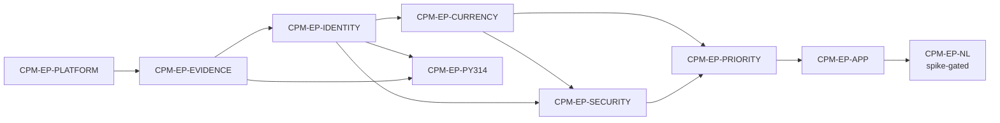

# Conda Package Supply Chain Monitor — Epic Breakdown

## Overview

This document decomposes the PRD requirements and the architecture spine's invariants into
implementable stories. There is no UX design contract; `CPM-EP-APP` builds views against
the PRD's user journeys and the spine's surface rules alone.

## Identifier Scheme

The imported `django-15-factor-base` platform owns the **bare** identifiers — `AD-1`–`AD-31`,
`FR-4`–`FR-44`, `NFR-1`–`NFR-7`, `Epic 2`–`Epic 9`, `Story x.y`, `CG-3`, `R-2`/`R-3`/`R-5`,
`SC-6` — referenced across 45 files under `src/`. They are never renumbered or reused.

Everything this document creates carries `CPM-`:

| Kind | Form | Example |
|---|---|---|
| Epic | `CPM-EP-<NAME>` (non-positional, fixed by the PRD) | `CPM-EP-EVIDENCE` |
| Story | `CPM-<EPIC>-S<nn>` (sequential within its epic) | `CPM-EVIDENCE-S01` |
| Requirement | `CPM-FR-n` / `CPM-NFR-n` (from the PRD) | `CPM-FR-36` |
| Invariant | `CPM-AD-n` (from the spine) | `CPM-AD-2` |

A bare `FR-17` in this repository is the platform's authentication-surface allowlist;
`CPM-FR-17` is this product's vulnerability rollup policy.

## Requirements Inventory

### Functional Requirements

- **CPM-FR-1** — Resolve package identity. The system resolves each inventory package to a canonical name, a source repository, its release ecosystem identity (PyPI for the Python packages v1 targets), and zero or more conda-forge feedstocks.
- **CPM-FR-2** — Persist identity provenance and confidence. Every resolution records where it came from and how confident it is.
- **CPM-FR-3** — Manual package-identity override. A platform lead can correct a package identity from the application, on the record. This is the only human write that mutates **governed reference data**. Queue actions (CPM-FR-25) write **workflow state**, which is a separate class: it records what a human decided about a finding, and never alters the package identity or the evidence beneath it.
- **CPM-FR-4** — Package-identity review queue. Unmapped and low-confidence packages surface as a worked queue, not a report.
- **CPM-FR-5** — Confidence gates what automation may claim. Confidence constrains what the system asserts about a package.
- **CPM-FR-6** — Not-applicable is a distinct outcome. A check that does not apply to a package is never folded into clean or unknown.
- **CPM-FR-42** — Inventory ingestion. The system acquires the package inventory and its internal usage signals from the organization's internal source, as append-only evidence.
- **CPM-FR-7** — Source release collector. Obtains latest release or tag, its date, and a repository activity signal from the package's source repository.
- **CPM-FR-8** — PyPI collector. Obtains project existence, latest version and date, and `Requires-Python` metadata.
- **CPM-FR-9** — Conda-forge feedstock collector. Obtains feedstock existence, recipe version, recipe metadata, and recent recipe activity.
- **CPM-FR-10** — Published conda package collector. Obtains published version, build string, and channel for each monitored channel.
- **CPM-FR-11** — Vulnerability collector. Matches package and version against advisory sources and records affected and fixed ranges.
- **CPM-FR-12** — KEV collector. Cross-references vulnerability findings against the KEV catalog.
- **CPM-FR-13** — License collector. Extracts and normalizes license metadata and records the raw value alongside the normalized expression.
- **CPM-FR-14** — Python 3.14 readiness collector. Performs static metadata assessment by default; build and import verification is a separate, optionally triggered capability.
- **CPM-FR-15** — Collector independence and run records. Each collector writes only its own evidence table plus the collection-run record.
- **CPM-FR-16** — Version currency policy. Compares source, PyPI, feedstock recipe, and published conda versions using a documented release-authority order recorded per package.
- **CPM-FR-17** — Vulnerability and KEV rollup policy. Derives the per-package vulnerability status and risk level from vulnerability and KEV evidence.
- **CPM-FR-18** — License policy. Derives allowed, restricted, forbidden, unknown, or manual-review from a versioned, data-driven policy.
- **CPM-FR-19** — Python 3.14 readiness policy. Derives readiness status, keeping inferred and verified evidence distinguishable.
- **CPM-FR-20** — Priority bucket and score. Assigns `P1`–`P10` by top-down first-match rules and computes a 1–100 score from internal usage signals to rank within a bucket.
- **CPM-FR-21** — Work type derivation. Derives the recommended work type independently of the priority bucket.
- **CPM-FR-40** — Feedstock presence and maintenance policy. Derives whether a conda-forge feedstock exists for a package and, where one does, whether it appears maintained. Realizes CPM-UJ-2.
- **CPM-FR-41** — Remediation readiness policy. Derives whether a package with an open finding can actually be acted on now. Realizes CPM-UJ-1.
- **CPM-FR-22** — Policy versioning and replay. Every policy run is versioned and re-runnable against historical evidence.
- **CPM-FR-23** — Current package-health view. An authenticated user can browse, filter, and sort current package health across the inventory.
- **CPM-FR-24** — Package detail with evidence provenance. An authenticated user can open one package and see every current status traced to the evidence that produced it.
- **CPM-FR-25** — Role-scoped work queues. Each role reaches its own queue: the identity review queue (CPM-FR-4), the remediation work queue, and the compliance review queue.
- **CPM-FR-26** — Operational reports. The application produces the recurring reports the roles depend on: daily KEV, weekly feedstock lag, Python 3.14 readiness, license exceptions, unmapped identities, and stale-evidence and collector failures.
- **CPM-FR-27** — Governed API. A documented HTTP API exposes the current-health, package-detail, and report reads.
- **CPM-FR-28** — Operational probes. Liveness and readiness endpoints report process and dependency health.
- **CPM-FR-29** — Authenticate through the organization's identity provider. Users authenticate via OIDC against the organization's provider.
- **CPM-FR-30** — Map group claims to roles. Asserted group claims resolve to the three roles.
- **CPM-FR-31** — Role-scoped surfaces. Each role reaches the evidence, queues, and reports it is responsible for.
- **CPM-FR-32** — Privileged writes are audited. Every write that changes governed data records who did it and why.
- **CPM-FR-33** — Governed read-only analytics access. Analytics and natural-language components reach the data through a read-only role over approved views.
- **CPM-FR-34** — Evidence-cited natural-language answers. A user can ask a question in natural language and receive an answer traceable to evidence.
- **CPM-FR-35** — Repeatable investigation and reporting compositions. The recurring investigations and reports are composable and repeatable rather than re-prompted each time.
- **CPM-FR-36** — Evidence is append-only. No finding is overwritten in place; each observation is a new row.
- **CPM-FR-37** — Current values are derived and timestamped. Current status is computed from the latest eligible evidence and exposes that evidence's timestamp.
- **CPM-FR-38** — Staleness and failure are visible. Evidence past its freshness target, failed collection, and unavailable sources are shown as themselves.
- **CPM-FR-39** — Observations carry correlation identifiers. Every collection run and privileged write is traceable to the process that performed it.

### NonFunctional Requirements

- **CPM-NFR-1** — Full-inventory collection at 10,000 packages completes without manual batching.
- **CPM-NFR-2** — Collector cadences are configured independently — daily for security and KEV, daily to weekly for version currency, on demand for Python 3.14 build verification.
- **CPM-NFR-3** — External calls apply rate limiting, retries with backoff, request timeouts, and caching. A rate-limited source degrades to stale evidence, never to a clean result.
- **CPM-NFR-4** — Every collection response is paginated with an enforced maximum page size. No view or endpoint can return the unbounded inventory.
- **CPM-NFR-5** — The current-health view and its API equivalent respond within a stated p95 latency budget at full inventory size with filters applied. `[ASSUMPTION: budget to be set during architecture; the requirement is that one exists and is enforced.]`.
- **CPM-NFR-6** — Work that cannot complete inside a request — recollection, verification builds, policy runs, exports over a stated size — is asynchronous, and the user is told it is in progress rather than left waiting.
- **CPM-NFR-7** — Readiness and liveness probes answer independently of application load and are excluded from rate limiting.
- **CPM-NFR-8** — All LLM-facing components have read-only access, row limits, and query timeouts.
- **CPM-NFR-9** — Sensitive internal usage fields are not transmitted to an external model API without explicit approval; a private or self-hosted deployment must be supportable.
- **CPM-NFR-10** — Configuration comes from the environment; no credential, endpoint, or secret is committed or defaulted to a production value.
- **CPM-NFR-11** — Refused authorization, privileged writes, and analytics queries are logged with the acting user identity.
- **CPM-NFR-12** — Logs are structured and machine-parseable, and carry request, user, and trace identifiers.
- **CPM-NFR-13** — Requests, background tasks, database queries, and cache calls are traced, and traces correlate to the collection runs and writes they performed.

### Additional Requirements

Derived from the architecture spine and the state of the codebase. These are not PRD
requirements but they gate or shape the stories below.

**Net-new structure — nothing in `src/` does this yet:**

- `src/django_apps/` is a second import root declared in `pyproject.toml`'s
  `[tool.hatch.build.targets.wheel]` table. **Not** by appending it to a `sources` array
  alongside `"src"` — `CPM-PLATFORM-S01` proved that a silent no-op, because hatchling sorts
  `sources` ascending and matches the first prefix, so `"src"` always shadows
  `"src/django_apps"`. The table carries a mapping of the three subtrees instead, plus
  `dev-mode-exact` so the editable install is a finder rather than directories on `sys.path`.
  Domain applications live under one package inside that root,
  `conda_package_supply_chain_monitor`, and `django_apps` never appears in an import statement.
- No DRF pagination is configured. `REST_FRAMEWORK` sets auth, permission and schema
  classes only — `DEFAULT_PAGINATION_CLASS` and `PAGE_SIZE` are absent (`CPM-AD-12`).
- Only one `DATABASES` alias (`default`) exists, and `DATABASE_ROUTERS` is never assigned —
  it appears solely in `config/startup/allowlist.py`'s `CONTRIBUTABLE_KEYS` (`CPM-AD-16`).
- No Celery queue conventions exist: no `CELERY_TASK_ROUTES`, no `CELERY_TASK_DEFAULT_QUEUE`,
  no `CELERY_BEAT_SCHEDULE`. Only `CELERY_BEAT_SCHEDULER` is set (`CPM-AD-20`).

**Inherited platform constraints every story must obey:**

- App adoption is explicit and two-line — a `pixi.toml` dependency plus an `adopted_apps`
  entry in `component.toml`, order load-bearing. Entry-point discovery is forbidden (`AD-8`).
- A domain app may contribute only to `DATABASES`, `DATABASE_ROUTERS`, `INSTALLED_APPS`,
  `NAVIGATION_REGISTRY`, `CELERY_BEAT_SCHEDULE`, `CELERY_IMPORTS`, `CELERY_TASK_ROUTES` —
  never `AUTHENTICATION_BACKENDS`, `DEFAULT_AUTHENTICATION_CLASSES`,
  `DEFAULT_PERMISSION_CLASSES` or `MIDDLEWARE`.
- Every refusal raises `ImproperlyConfigured`; never a warning, never log-and-continue (`CG-3`).
- New process types and per-database release-stage migration steps are declared in
  `component.toml` and nowhere else (`AD-28`).
- Authorization is already resolved per request and synced to Django groups (`AD-10`);
  `CPM-FR-29` and `CPM-FR-30` are largely inherited, not built.
- Health and drain probes are already mounted at the root behind no prefix (`AD-22`);
  `CPM-FR-28` is inherited, not built.

**Project standards — the definition of done for every story:**

- `pixi` is the only Python runner. Never `uv`, never bare `python`, never `pip`.
- Every code change ships with tests. Unit tests touch no database, network or filesystem;
  integration tests live under `tests/integration/` and are marked automatically by directory.
- `pixi run ci` must exit 0 — precommit, build, typecheck, lint, then test-cov at a 90% floor.
- Conventional Commits; branches prefixed `feature/`, `bugfix/` or `hotfix/`.

**Values that must NOT be invented.** These are open questions in the PRD. A story may build
the mechanism that reads them as versioned data, but must not fabricate their content:

| Open question | What stays unspecified |
|---|---|
| OQ 1 | Advisory and KEV source selection |
| OQ 2 | License allow/deny policy content |
| OQ 3 | The inventory source and the internal usage-signal field set |
| OQ 5 | The p95 latency budget and the sync export row cap |
| OQ 7 | Per-collector freshness targets and observation windows |
| OQ 8 | The priority rule set and the score function |
| OQ 10 | The feedstock inactivity threshold |

### UX Design Requirements

None. No UX design contract exists for this product. `CPM-EP-APP` derives its surface
behaviour from the PRD's three user journeys (`CPM-UJ-1`–`CPM-UJ-3`), the role table in
brief §2, and the spine's surface invariants (`CPM-AD-9`–`CPM-AD-14`, `CPM-AD-22`,
`CPM-AD-24`).

**This is a known gap, not an omission.** See the open question raised at the end of this
step.

### FR Coverage Map

Every one of the 41 functional requirements maps to exactly one epic — no gaps, no
duplicates. Non-functional requirements are assigned to the epic that first has to satisfy
them; later epics inherit rather than re-implement.

| Requirement | Epic | Delivers |
|---|---|---|
| `CPM-FR-1` – `CPM-FR-6` | `CPM-EP-IDENTITY` | Package identity resolution, provenance, confidence gating, the review queue, five-state outcomes |
| `CPM-FR-32` | `CPM-EP-IDENTITY` | Privileged writes are audited |
| `CPM-FR-42` | `CPM-EP-IDENTITY` | Inventory ingestion as evidence |
| `CPM-FR-36` – `CPM-FR-38` | `CPM-EP-EVIDENCE` | Append-only storage, derived-and-timestamped current values, visible staleness and failure |
| `CPM-FR-7` – `CPM-FR-10` | `CPM-EP-CURRENCY` | Source, PyPI, feedstock and published-conda collectors |
| `CPM-FR-15` | `CPM-EP-CURRENCY` | Collector independence and run records |
| `CPM-FR-16`, `CPM-FR-40` | `CPM-EP-CURRENCY` | Version currency and feedstock presence policies |
| `CPM-FR-11` – `CPM-FR-13` | `CPM-EP-SECURITY` | Vulnerability, KEV and license collectors |
| `CPM-FR-17`, `CPM-FR-18`, `CPM-FR-41` | `CPM-EP-SECURITY` | Vulnerability/KEV rollup, license policy, remediation readiness |
| `CPM-FR-14`, `CPM-FR-19` | `CPM-EP-PY314` | Python 3.14 assessment collector and readiness policy |
| `CPM-FR-20` – `CPM-FR-22` | `CPM-EP-PRIORITY` | Priority bucket, score, work type, policy versioning and replay |
| `CPM-FR-23` – `CPM-FR-27` | `CPM-EP-APP` | Health view, package detail, queues, reports, governed API |
| `CPM-FR-31` | `CPM-EP-APP` | Role-scoped surfaces |
| `CPM-FR-28` – `CPM-FR-30`, `CPM-FR-39` | `CPM-EP-PLATFORM` | Probes, OIDC authentication, group-claim mapping, correlation identifiers — **inherited, largely complete** |
| `CPM-FR-33` – `CPM-FR-35` | `CPM-EP-NL` | Governed analytics access, evidence-cited answers, repeatable compositions |

### Non-functional coverage

The PRD's epic table assigned only six of thirteen. The remaining seven are placed here:

| Requirement | Epic | Note |
|---|---|---|
| `CPM-NFR-10`, `CPM-NFR-12`, `CPM-NFR-13` | `CPM-EP-PLATFORM` | Environment config, structured logs, tracing — inherited |
| `CPM-NFR-7` | `CPM-EP-PLATFORM` | Probes answer independently of load — inherited |
| `CPM-NFR-3` | `CPM-EP-EVIDENCE` | **Newly assigned.** Rate limiting, retry/backoff, timeouts and caching live in the shared collector base in `core` (`CPM-AD-20`), which this epic builds |
| `CPM-NFR-1`, `CPM-NFR-2` | `CPM-EP-CURRENCY` | **Newly assigned.** First epic to collect at full inventory scale and the one that establishes cadence-as-data |
| `CPM-NFR-4` – `CPM-NFR-6` | `CPM-EP-APP` | Pagination, latency budget, async boundary |
| `CPM-NFR-11` | `CPM-EP-APP` | **Newly assigned.** Refused authorization is logged here; the privileged-write half is satisfied by `CPM-FR-32` in `CPM-EP-IDENTITY` |
| `CPM-NFR-8`, `CPM-NFR-9` | `CPM-EP-NL` | **Newly assigned.** Read-only access with row limits and timeouts; no sensitive fields to an external model |

## Epic List

Nine epics, on the non-positional keys the PRD fixed. They are not renumbered here, and
adding one later never renumbers another.

Build order is a dependency graph, not the list order below.

### `CPM-EP-PLATFORM`: The service platform

The Django service platform is already imported and running: settings and the two-stage
startup gates, OIDC authentication with group-claim sync, structured logging and tracing,
health and drain probes, Celery, and the `component.toml` deployment contract.

**Largely complete.** Its stories are the gaps between what the accelerator provides and
what this product needs — chiefly declaring `src/django_apps/` as a second import root.

**FRs covered:** `CPM-FR-28`, `CPM-FR-29`, `CPM-FR-30`, `CPM-FR-39`
**NFRs covered:** `CPM-NFR-7`, `CPM-NFR-10`, `CPM-NFR-12`, `CPM-NFR-13`
**Depends on:** nothing

### `CPM-EP-EVIDENCE`: An evidence log that cannot lie

Delivers the shared kernel every later epic builds on: the append-only base that refuses
an update, the five-state `OutcomeState` enum with its single precedence order, the
mutable run-ledger models, and the collector base carrying retry, backoff, timeout and
rate limiting.

**User outcome:** an operator can see that a collection run started, failed and left an
`error` state — rather than seeing nothing at all.

**FRs covered:** `CPM-FR-36`, `CPM-FR-37`, `CPM-FR-38`
**NFRs covered:** `CPM-NFR-3`
**Depends on:** `CPM-EP-PLATFORM`
**Governed by:** `CPM-AD-2`, `CPM-AD-3`, `CPM-AD-5`, `CPM-AD-15`, `CPM-AD-23`

### `CPM-EP-IDENTITY`: Every package resolved, or visibly not

Delivers the package identity layer: resolution to canonical name, source repository,
release ecosystem and feedstocks; recorded provenance and confidence; the confidence gate
that constrains what automation may claim; the review queue; and the audited override.

**User outcome:** a platform lead can carry an unmapped package to a resolved, attributed
identity and correct a wrong one on the record — `CPM-UJ-3`.

**FRs covered:** `CPM-FR-1` – `CPM-FR-6`, `CPM-FR-32`, `CPM-FR-42`
**Depends on:** `CPM-EP-EVIDENCE`
**Governed by:** `CPM-AD-1`, `CPM-AD-3`, `CPM-AD-4`, `CPM-AD-14`, `CPM-AD-25`

### `CPM-EP-CURRENCY`: Where a package sits across every surface

Delivers the four version collectors, the run records that make them independent, and the
currency and feedstock-presence policies — plus the scheduling and queue conventions every
later collector inherits.

**User outcome:** a packaging engineer can see source, PyPI, recipe and published conda
versions side by side, and find packages with no feedstock — `CPM-UJ-2`.

**FRs covered:** `CPM-FR-7` – `CPM-FR-10`, `CPM-FR-15`, `CPM-FR-16`, `CPM-FR-40`
**NFRs covered:** `CPM-NFR-1`, `CPM-NFR-2`
**Depends on:** `CPM-EP-IDENTITY`, `CPM-EP-EVIDENCE`
**Governed by:** `CPM-AD-6`, `CPM-AD-7`, `CPM-AD-8`, `CPM-AD-20`
**Inherits from `CPM-EP-EVIDENCE`:** the three queues, the collector base, and the policy run its policies register as passes with.

### `CPM-EP-SECURITY`: Vulnerability, KEV and licence exposure

Delivers the vulnerability, KEV and licence collectors and their policies, plus
remediation readiness — whether a finding can actually be acted on now.

**User outcome:** a security reviewer sees which findings are real, current and theirs to
act on, with evidence attached — `CPM-UJ-1`.

**FRs covered:** `CPM-FR-11` – `CPM-FR-13`, `CPM-FR-17`, `CPM-FR-18`, `CPM-FR-41`
**Depends on:** `CPM-EP-IDENTITY`, `CPM-EP-CURRENCY`
**Governed by:** `CPM-AD-5`, `CPM-AD-7`, `CPM-AD-8`, `CPM-AD-20`
**Constrained:** advisory and KEV source selection is PRD Open Question 1; licence policy
content is Open Question 2. Stories build the mechanism, not the values.

### `CPM-EP-PY314`: Inferred and verified compatibility, kept apart

Delivers static metadata assessment, then optional compute-backed build and import
verification, keeping inferred and verified evidence distinguishable.

**User outcome:** a packaging engineer can tell a package believed compatible from one
proven compatible on a stated platform.

**FRs covered:** `CPM-FR-14`, `CPM-FR-19`
**Depends on:** `CPM-EP-IDENTITY`, `CPM-EP-EVIDENCE`
**Governed by:** `CPM-AD-5`, `CPM-AD-7`, `CPM-AD-20` (the `verify` queue)

### `CPM-EP-PRIORITY`: A ranked, explainable queue of work

Delivers the orchestrated policy run, the single rollup writer, priority bucket, score,
rank and work type — every one explainable without reading the rule set — and policy
versioning with replay.

**User outcome:** every role opens a queue ranked by risk and internal impact rather than
by who asked loudest.

**FRs covered:** `CPM-FR-20`, `CPM-FR-21`, `CPM-FR-22`
**Depends on:** `CPM-EP-CURRENCY`, `CPM-EP-SECURITY`
**Governed by:** `CPM-AD-8`, `CPM-AD-11`, `CPM-AD-21`
**Inherits from `CPM-EP-EVIDENCE`:** the orchestrated policy run and the rollup writer. This epic adds passes to them, it does not build them.
**Constrained:** the rule set and score function are Open Question 8. Stories build them as
versioned data with explainable output; they do not fabricate the content.

### `CPM-EP-APP`: The surface the three roles actually work in

Delivers the authenticated application and the governed API: the current-health view,
package detail traced to evidence, the three role-scoped queues, the six operational
reports, and role scoping enforced centrally.

**User outcome:** all three roles do their whole job in the application — no database
console. This epic is where `CPM-UJ-1`, `CPM-UJ-2` and `CPM-UJ-3` become real.

**FRs covered:** `CPM-FR-23` – `CPM-FR-27`, `CPM-FR-31`
**NFRs covered:** `CPM-NFR-4`, `CPM-NFR-5`, `CPM-NFR-6`, `CPM-NFR-11`
**Depends on:** `CPM-EP-PRIORITY`
**Governed by:** `CPM-AD-9` – `CPM-AD-14`, `CPM-AD-22`, `CPM-AD-24`
**No UX design contract exists.** Stories specify behaviour, data and acceptance criteria;
presentation is the implementer's.

### `CPM-EP-NL`: Governed natural-language investigation

Delivers the second read-only database connection, the governed views, the LangChain tool
layer whose answers cite evidence, and repeatable compositions.

**User outcome:** a reviewer investigates conversationally and can trace every figure to
the evidence row behind it.

**FRs covered:** `CPM-FR-33`, `CPM-FR-34`, `CPM-FR-35`
**NFRs covered:** `CPM-NFR-8`, `CPM-NFR-9`
**Depends on:** `CPM-EP-APP`
**Governed by:** `CPM-AD-16`, `CPM-AD-17`, `CPM-AD-18`, `CPM-AD-24`
**Carried test requirement:** `NL.01-INT-001` — the analytics role cannot write, asserted
at the database permission level — is authored onto the `CPM-AD-16` story when the spike
reports, not onto the spike itself: the alias does not exist yet, and `CPM-AD-16` is
settled independently of the spike's outcome.
**BLOCKED.** Not plannable until a fitness spike establishes LangChain's conda-forge
availability and its transitive resolution against Python 3.14. Only the spike story is
written; the rest waits on its outcome.

### Build order

---

# Stories

Story keys are `CPM-<EPIC>-S<nn>`, sequential within their epic. Every story is sized for a
single dev session, depends only on stories before it, and creates only the models it needs.

Each carries the requirements it satisfies and the invariants that govern it. A story never
restates an invariant's rule — it inherits it, and its acceptance criteria are written so a
violation fails a test.

## CPM-EP-PLATFORM: The service platform

The platform is imported and running. These stories close the gap between what the
accelerator provides and what this product needs.

### CPM-PLATFORM-S01: A second import root for domain applications

As a developer,
I want `src/django_apps/` to be an importable second root with one app in it,
So that every domain application has a declared home before any of them is written.

**Acceptance Criteria:**

**Given** `pyproject.toml` declares `src/` as the wheel root
**When** `src/django_apps/` is added to the same `[tool.hatch.build.targets.wheel]` sources
**Then** `django_apps` imports as a top-level package alongside `config` and `django_service`
**And** the import root is declared in exactly one place, and a test pins that it is not declared twice

**Given** the new root exists
**When** a minimal `django_apps.core` application is created following the `django_service/users/` layout
**Then** it is adopted in two lines — a `pixi.toml` entry and an `adopted_apps` entry in `component.toml` — in that order
**And** nothing self-registers and no entry-point discovery is introduced

**Given** the app is adopted
**When** `pixi run ci` runs
**Then** it exits 0 with coverage at or above the 90% floor

**Satisfies:** structural prerequisite for every later epic
**Governed by:** `CPM-AD-19`, inherited `AD-8`, `AD-28`

### CPM-PLATFORM-S02: Group claims resolve to the three product roles

As a platform lead,
I want the identity provider's group claims to grant one of the three product roles,
So that a person's access follows from what the provider asserts, with no manual step.

**Acceptance Criteria:**

**Given** the platform already syncs asserted group claims to Django groups
**When** the three product role groups are provisioned by migration, as the platform provisions its designated groups
**Then** a person whose claims assert a role group holds that role at their next authentication
**And** a group revoked at the provider removes the role at the next resolution

**Given** a role group name is configured
**When** the configuration is read
**Then** it comes from the environment and has no default value baked into the settings module

**Given** an authentication asserts no group claim at all
**When** authorization is resolved
**Then** it is refused, and that refusal is distinguishable from an authentication asserting zero groups

**Satisfies:** `CPM-FR-29`, `CPM-FR-30`
**Governed by:** inherited `AD-10`, `R-2`, `CG-3`
**Note:** authentication itself, the probes (`CPM-FR-28`) and trace correlation (`CPM-FR-39`) are inherited and already working; this story adds only the product's role groups.

## CPM-EP-EVIDENCE: An evidence log that cannot lie

Delivers the shared kernel every later epic builds on. Nothing here is user-facing, and
everything here is load-bearing: get it wrong and every collector inherits the mistake.

### CPM-EVIDENCE-S01: Five outcome states with one precedence order

As a developer,
I want a single status type carrying `not_applicable`, `unknown`, `not_found` and `error`,
So that no two policies can invent incompatible vocabularies for the same idea.

**Acceptance Criteria:**

**Given** `django_apps.core` exists
**When** `OutcomeState` is defined as a `TextChoices` with fixed lowercase string values
**Then** it carries `not_applicable`, `unknown`, `not_found` and `error`
**And** a per-status determinate type inherits those four sentinels by name *and* value

**Given** a derived status needs storing
**When** the field is declared
**Then** it is a `CharField` with `choices`, never a boolean and never a nullable boolean
**And** a test enumerates every derived-status field from the model registry, never a
hand-written list, and asserts the four sentinels are present (`EVIDENCE.01-AUDIT-001`)

**Given** two statuses must be aggregated into one
**When** the precedence order is applied
**Then** it comes from the single total order defined in `core`
**And** a test asserts no other module defines an ordering

**Given** any module in the project
**When** it needs the current time
**Then** it takes it from the injected clock in `core`, and an audit fails on a direct
`timezone.now()` call (`EVIDENCE.01-AUDIT-002`)

**Satisfies:** `CPM-FR-6`
**Governed by:** `CPM-AD-5`, `CPM-AD-26`

### CPM-EVIDENCE-S02: Evidence that refuses to be updated

As a compliance reviewer,
I want an observation to be impossible to overwrite,
So that what the system knew at a point in time can always be reconstructed.

**Acceptance Criteria:**

**Given** an abstract append-only base model in `core`
**When** `save()` is called on an instance whose primary key is already set
**Then** it raises rather than updating
**And** the manager exposes no `update()` or `delete()` path

**Given** an unchanged fact is observed again
**When** the collector writes it
**Then** a new row is inserted with a new `observed_at`
**And** no evidence table carries a unique constraint that would suppress that insert

**Given** any evidence model in the project
**When** the test suite runs
**Then** a test asserts it inherits the append-only base

**Given** an evidence table
**When** the audit runs
**Then** it fails on any `queryset.update()`, `bulk_update()` or raw SQL write against
that table — the bypass `save()` cannot catch (`EVIDENCE.02-AUDIT-002`)

**Satisfies:** `CPM-FR-36`
**Governed by:** `CPM-AD-2`, `CPM-AD-7`

### CPM-EVIDENCE-S03: A run ledger that survives a killed worker

As a platform lead,
I want every collection and policy run recorded from before it starts until after it ends,
So that a run that died mid-call is visible rather than absent.

**Acceptance Criteria:**

**Given** run-ledger models in `core`
**When** they are defined
**Then** they are mutable and explicitly exempt from the append-only base, and that exemption is documented at the definition

**Given** a run begins
**When** the ledger row is written
**Then** it is created with status `running` *before* the first outbound call
**And** it carries the collector or policy name, the package, and the `trace_id` of the request or task

**Given** a run ends by any path including an exception
**When** control leaves the run
**Then** the row is finalized in a `finally` to `succeeded`, `partial`, `failed` or `skipped`
**And** a collector raising mid-run still finalizes its row, which is never absent
(`EVIDENCE.03-INT-002`)

**Given** a worker is killed mid-run
**When** the coverage view is queried
**Then** the row is still present showing `running`, and "started and never finished" is answerable

**Given** a collector whose run is not scoped to a single package
**When** its ledger row is written
**Then** the package reference is absent rather than fabricated, and "started and never
finished" stays answerable for that run

**Satisfies:** `CPM-FR-39`, and the ledger half of `CPM-FR-38`
**Governed by:** `CPM-AD-2`, `CPM-AD-15`

### CPM-EVIDENCE-S04: Three queues and cadence as data

As a platform lead,
I want collection, policy and verification work on separate queues with cadence in the scheduler,
So that a compute-backed build cannot starve the daily security sweep.

**Acceptance Criteria:**

**Given** no Celery routing exists today
**When** routing is configured
**Then** three queues exist — `collect` for external I/O, `policy` for CPU work, `verify` for compute-backed builds
**And** tasks reach them through `CELERY_TASK_ROUTES`, contributed via the platform's allowlist

**Given** any scheduled work
**When** its cadence is set
**Then** it lives in the database scheduler as data, never as a decorator on the task

**Given** a task that would exceed the inherited 5-minute time limit
**When** the work is designed
**Then** it is chunked per package rather than the limit being raised

**Given** every registered task
**When** routing is audited
**Then** each task's declared route resolves to one of the three queues, asserted as
configuration because eager Celery hides routing (`EVIDENCE.04-AUDIT-001`)

**Satisfies:** `CPM-NFR-2`
**Governed by:** `CPM-AD-20`, `CPM-AD-9`
**Note:** built here rather than in a collector epic because `CPM-EP-CURRENCY`, `CPM-EP-SECURITY` and `CPM-EP-PY314` all need these queues and none depends on the others.

### CPM-EVIDENCE-S05: One collector base carrying every external-call rule

As a developer,
I want retry, backoff, timeout, rate limiting and the observation window in one place,
So that eight collectors cannot each implement them differently.

**Acceptance Criteria:**

**Given** a collector base in `core`
**When** a collector makes an outbound call through it
**Then** the call has a timeout, a rate limit and retry with backoff applied by the base
**And** no collector implements any of them itself

**Given** a successful run already exists for this collector and package inside the configured observation window
**When** the collector runs again
**Then** it records a ledger row with status `skipped` and writes no evidence

**Given** a recollection is triggered manually
**When** the collector runs
**Then** it bypasses the observation window and always writes

**Given** an external source is rate-limited or unavailable
**When** the call ultimately fails
**Then** an evidence row carrying `error` or `not_found` is inserted, never a clean result, and never no row

**Satisfies:** `CPM-NFR-3`
**Governed by:** `CPM-AD-7`, `CPM-AD-20`
**Constrained:** observation-window and freshness-target *values* are PRD Open Question 7. This story builds the mechanism and reads them as per-collector configuration; it does not choose them.

### CPM-EVIDENCE-S06: Stale and failed evidence read as themselves

As a platform lead,
I want evidence past its freshness target and failed collection to be visibly distinct from clean,
So that the coverage view tells me what the monitor cannot see.

**Acceptance Criteria:**

**Given** a freshness target configured per collector
**When** the latest evidence for a package and collector is older than that target
**Then** it reports `stale`, and `stale` is never rendered as clean

**Given** collection runs that failed
**When** the collector-health query runs
**Then** failures are retrievable in the application layer, not only from logs
**And** each failure exposes its error detail and its `trace_id`

**Given** derived state
**When** any model holding it is defined
**Then** no current-status field is directly writable from outside a policy run

**Given** a registered collector that declares no freshness target
**When** the application starts
**Then** startup raises `ImproperlyConfigured` rather than defaulting to fresh-forever
(`EVIDENCE.06-AUDIT-001`)

**Satisfies:** `CPM-FR-37`, `CPM-FR-38`
**Governed by:** `CPM-AD-5`, `CPM-AD-11`, `CPM-AD-28`

### CPM-EVIDENCE-S07: The policy run, and the one writer of the rollup

As a developer,
I want an orchestrated policy run with one cut-off and a single rollup writer,
So that every later policy has something correct to plug into rather than inventing its own.

**Acceptance Criteria:**

**Given** a policy run
**When** it is scheduled
**Then** beat schedules the run, never an individual pass
**And** the run has one identifier, one cut-off, and a declared ordered list of passes

**Given** a cut-off
**When** it is chosen
**Then** it is the `finished_at` of a completed collection run, never the current time
**And** no pass reads evidence written by a collection run still `running`

**Given** any policy pass registered with the run
**When** it writes its results
**Then** it writes only its own per-domain derived table, keyed `(package, policy_run)`
**And** a test asserts no pass writes the rollup

**Given** the passes have completed
**When** the rollup is composed
**Then** one writer performs a full-row replace per package inside one transaction, stamped with the policy run id, the run's cut-off, and a per-domain version map
**And** the rollup holds exactly one row per inventory package, always — including `unmapped` packages, whose gated statuses read `unknown`

**Given** the rollup
**When** its storage is chosen
**Then** it is a Django-managed table inside the migration graph, not a database materialized view, and it carries `computed_at`

**Given** a pass that needs another pass's output
**When** it runs
**Then** it reads a pass declared earlier in the same run, and never re-derives a status another pass owns

**Given** the registered passes
**When** the ownership audit runs
**Then** every pass declares the derived table it owns, and none declares the rollup
(`EVIDENCE.07-AUDIT-002`)

**Given** two passes writing different domains in one run
**When** the run completes
**Then** both results survive, and neither is reset to defaults (`EVIDENCE.07-INT-001`)

**Satisfies:** `CPM-FR-37`, and the orchestration half of `CPM-FR-22`
**Governed by:** `CPM-AD-8`, `CPM-AD-11`, `CPM-AD-21`, `CPM-AD-23`, `CPM-AD-4`
**Note:** built here, not in `CPM-EP-PRIORITY`, because the currency, feedstock, vulnerability, licence and readiness policies all run as passes and all land before priority does. The rollup composes whatever derived tables exist, so it grows as passes are added.
## CPM-EP-IDENTITY: Every package resolved, or visibly not

Delivers the package identity layer and the one audited human write in the product.

### CPM-IDENTITY-S01: The package identity model

As a developer,
I want one row per package holding identity and nothing else,
So that no observation or derived status can be written onto it later.

**Acceptance Criteria:**

**Given** the `identity` application
**When** the `Package` model is defined
**Then** its primary key is a surrogate integer and `canonical_name` is a unique indexed column
**And** `canonical_name` is never a foreign-key target, so correcting it does not cascade

**Given** the model
**When** its fields are reviewed
**Then** it holds only canonical name, cross-ecosystem mappings, provenance and confidence
**And** it holds no derived status, no observation and no workflow state
**And** it holds no internal usage signal; those are observed evidence (`CPM-AD-25`)

**Given** the PRD's export column headings
**When** an export is produced
**Then** the headings are applied by the reporting layer, and no model field is named for one

**Satisfies:** the model prerequisite for `CPM-FR-1` – `CPM-FR-6`
**Governed by:** `CPM-AD-1`, `CPM-AD-3`

### CPM-IDENTITY-S02: Resolution that records where it came from

As a packaging engineer,
I want each package resolved to its mappings with the provenance and confidence recorded,
So that I can tell a verified mapping from an inferred one.

**Acceptance Criteria:**

**Given** an inventory package
**When** resolution runs
**Then** it records canonical name, source repository, release ecosystem identity and zero or more feedstocks
**And** every resolution records an identity source, an associator key and a confidence

**Given** a mapping cannot be established
**When** resolution completes
**Then** it records `unmapped`, never a guess

**Given** a package type to which a mapping does not apply
**When** resolution completes
**Then** it records `not_applicable`, distinct from `unmapped` and from a successful empty result

**Given** an existing `verified` confidence
**When** a lower-confidence resolution runs
**Then** it does not overwrite it

**Satisfies:** `CPM-FR-1`, `CPM-FR-2`, `CPM-FR-6`
**Governed by:** `CPM-AD-1`, `CPM-AD-4`

### CPM-IDENTITY-S03: Confidence gates what the system will claim

As a security reviewer,
I want an unmapped package to never read as current or clean,
So that absence of evidence is never presented as evidence of absence.

**Acceptance Criteria:**

**Given** a single gate function in `core`
**When** a package at `unmapped` confidence is evaluated
**Then** every gated status is written as `unknown`, and the package is never reported current, clean, or lacking a feedstock

**Given** a package at `inventory-derived` confidence
**When** it is evaluated
**Then** the result is shown with a confidence label and its value is not degraded

**Given** the gate
**When** the test suite runs
**Then** a test asserts the gate is implemented once and not re-implemented per policy

**Satisfies:** `CPM-FR-5`
**Governed by:** `CPM-AD-4`

### CPM-IDENTITY-S04: Unresolved packages are selectable and ranked

As a platform lead,
I want the set of packages needing identity review to be queryable and ranked,
So that the review surface has something correct to render before the surface exists.

**Acceptance Criteria:**

**Given** packages at `unmapped` or `inventory-derived` confidence
**When** the unresolved-package selection runs
**Then** it returns every one of them, ranked by internal usage breadth
**And** candidate mappings and the evidence for each are available where any exist

**Given** a package whose confidence reaches `verified`
**When** the selection runs again
**Then** it no longer appears

**Given** this story
**When** its scope is reviewed
**Then** it creates no queue table and no workflow state — `CPM-AD-22` puts all three queues in the `workflow` app, which sits above `policies` and is built in `CPM-APP-S04`

**Satisfies:** the selection half of `CPM-FR-4`
**Governed by:** `CPM-AD-4`, `CPM-AD-1`
**Note:** the worked queue surface that completes `CPM-FR-4` is `CPM-APP-S05`. Split because `identity` sits below `policies` in the layer order and cannot host a workflow table.
**Constrained:** internal usage breadth is read from inventory evidence at a cut-off
(`CPM-AD-25`); its field set and source are PRD Open Question 3 and are not chosen here.

### CPM-IDENTITY-S05: The one audited human write

As a platform lead,
I want to correct a wrong package identity on the record,
So that a collector's mistake can be fixed without anyone editing the database directly.

**Acceptance Criteria:**

**Given** a user holding the override permission
**When** they submit a package-identity correction with a reason
**Then** the identity is updated and an override row records actor, timestamp, prior value, new value and reason
**And** both writes happen in one transaction, so neither survives alone
(`IDENTITY.05-INT-001`)

**Given** a user not holding the override permission
**When** they attempt the same write
**Then** it is refused, and the refusal is logged with the acting user identity

**Given** a submission with an empty reason
**When** it is validated
**Then** it is rejected

**Given** an override exists
**When** automated resolution next runs
**Then** the override survives, and is downgraded only by an explicit re-resolution

**Given** an auditor
**When** they query overrides
**Then** every human correction is retrievable as a set

**Satisfies:** `CPM-FR-3`, `CPM-FR-32`
**Governed by:** `CPM-AD-14`, `CPM-AD-23`

### CPM-IDENTITY-S06: The inventory arrives, and arrives as evidence

As a platform lead,
I want the package inventory and its usage signals observed like any other source,
So that every later story has packages to work on and a replay reads the numbers that were
true at its cut-off.

**Sequenced first.** Numbered last because story keys are never reused, built before
`CPM-IDENTITY-S02` because every story after it assumes packages exist.

**Acceptance Criteria:**

**Given** the inventory source configured as data
**When** the ingestion collector runs
**Then** it runs on the `collect` queue through the shared collector base, inheriting its
timeout, retry, backoff and ledger row
**And** the source location and its credentials come from the environment with no default

**Given** a source record naming a package that does not exist yet
**When** ingestion processes it
**Then** `identity`'s resolution service creates the shell at `unmapped` confidence
**And** the collector never writes the package table itself, and a test asserts it

**Given** a source record
**When** its snapshot is written
**Then** the shell and the snapshot commit in one per-package transaction
**And** the row is append-only, references the package by integer pk, and carries
`observed_at`, the usage signals as observed, and the run's `trace_id`

**Given** ingestion runs a second time over unchanged source data
**When** the rows are written
**Then** a new row is inserted rather than a prior one updated

**Given** a package present in an earlier run and absent from this one
**When** ingestion completes
**Then** absence is recorded as an observation with a timestamp, and no package row is deleted

**Given** a policy that reads a usage signal
**When** it runs
**Then** it reads the latest snapshot at or before its run's cut-off, and a replay at a stated
cut-off reproduces identical results

**Satisfies:** `CPM-FR-42`, and the inventory prerequisite for `CPM-FR-1` – `CPM-FR-6`
**Governed by:** `CPM-AD-25`, `CPM-AD-2`, `CPM-AD-3`, `CPM-AD-14`, `CPM-AD-23`
**Constrained:** the inventory source and the usage-signal field set are PRD Open Question 3.
This story builds the collector, the model and the cut-off-bound read; it does not choose the
source or invent the fields.

## CPM-EP-CURRENCY: Where a package sits across every surface

Delivers the four version collectors and the currency policies — and the scheduling and
queue conventions every later collector inherits.

### CPM-CURRENCY-S01: Upstream release evidence

As a packaging engineer,
I want the latest upstream release and its date recorded for each package,
So that I can tell whether a package is behind its own source.

**Acceptance Criteria:**

**Given** a package with a source repository
**When** the source collector runs
**Then** it records latest release or tag, its date, and a repository activity signal
**And** lookup status is recorded explicitly, including `not_found` and `error`

**Given** a repository that publishes no releases at all
**When** the collector runs
**Then** it records that fact rather than reporting the package stale

**Satisfies:** `CPM-FR-7`
**Governed by:** `CPM-AD-7`

### CPM-CURRENCY-S02: PyPI release evidence

As a packaging engineer,
I want PyPI existence, latest version and `Requires-Python` recorded,
So that Python packages can be compared against their primary release ecosystem.

**Acceptance Criteria:**

**Given** a Python package
**When** the PyPI collector runs
**Then** it records project existence, latest version and date, and `Requires-Python`

**Given** a package with no PyPI presence
**When** the collector runs
**Then** it records `not_found`

**Given** a non-Python package
**When** the collector runs
**Then** it records `not_applicable`, and the package is never marked stale against PyPI for not being published there

**Satisfies:** `CPM-FR-8`
**Governed by:** `CPM-AD-5`, `CPM-AD-7`

### CPM-CURRENCY-S03: Feedstock evidence

As a packaging engineer,
I want feedstock existence, recipe version and recipe activity recorded,
So that I can see whether conda-forge has caught up and whether anyone is maintaining it.

**Acceptance Criteria:**

**Given** a package
**When** the feedstock collector runs
**Then** it records feedstock existence, recipe version, recipe metadata and recent recipe activity
**And** absence of a feedstock is an observation with a timestamp, not a null

**Given** a package with a staged recipe but no feedstock
**When** the collector runs
**Then** staged-recipe state is recorded separately from an existing feedstock

**Satisfies:** `CPM-FR-9`
**Governed by:** `CPM-AD-7`

### CPM-CURRENCY-S04: Published conda package evidence

As a packaging engineer,
I want published version and build string recorded per monitored channel,
So that what is actually installable is visible alongside what the recipe says.

**Acceptance Criteria:**

**Given** the monitored channels
**When** the conda package collector runs
**Then** each channel produces its own observation, and channels are never merged
**And** each records published version, build string and channel

**Satisfies:** `CPM-FR-10`
**Governed by:** `CPM-AD-7`
**Constrained:** which channels and platforms are monitored is PRD Open Question 4. The collector reads them as configuration.

### CPM-CURRENCY-S05: One source failing never stops the others

As a platform lead,
I want a full-inventory sweep to survive a failing source,
So that one rate-limited provider does not cost me a day of monitoring everywhere else.

**Acceptance Criteria:**

**Given** a full sweep across 10,000 packages
**When** one collector fails for some packages
**Then** every other collector's run is unaffected and the overall run reports `partial`, not `failed`

**Given** a sweep in progress
**When** a package fails partway through
**Then** the transaction boundary is one package, and no earlier package's evidence is rolled back

**Given** the same collector, package, source and observation window
**When** the run is repeated
**Then** it does not duplicate evidence

**Given** 10,000 packages
**When** the sweep is scheduled
**Then** it completes without manual batching

**Satisfies:** `CPM-FR-15`, `CPM-NFR-1`
**Governed by:** `CPM-AD-7`, `CPM-AD-23`

### CPM-CURRENCY-S06: Currency judged against the right authority

As a packaging engineer,
I want each package compared against the ecosystem that is actually authoritative for it,
So that a package is never called stale against a registry it never published to.

**Acceptance Criteria:**

**Given** a package
**When** the currency policy runs
**Then** it compares source, PyPI, recipe and published conda versions using the authority order recorded on that package
**And** the chosen authority and its supporting evidence are stored with the result

**Given** no authority is explicitly set
**When** the policy runs
**Then** it applies the documented default order

**Given** a package current at source but behind on the feedstock
**When** currency is computed
**Then** the two are expressible separately, per surface

**Satisfies:** `CPM-FR-16`
**Governed by:** `CPM-AD-6`, `CPM-AD-8`

### CPM-CURRENCY-S07: Feedstock presence and maintenance

As a packaging engineer,
I want to know whether a feedstock exists and whether anyone is maintaining it,
So that I can find the gaps worth filling.

**Acceptance Criteria:**

**Given** a package at `verified` or `inventory-derived` confidence
**When** the feedstock policy runs
**Then** it derives one of absent, present-and-maintained, present-and-inactive, or staged-recipe-pending

**Given** a package at `unmapped` confidence
**When** the policy runs
**Then** it reports `unknown` and never absent

**Given** the inactivity threshold
**When** it is applied
**Then** it is read as a versioned policy parameter, not a constant in code

**Satisfies:** `CPM-FR-40`
**Governed by:** `CPM-AD-4`, `CPM-AD-8`
**Constrained:** the inactivity threshold and what counts as recipe activity are PRD Open Question 10.

## CPM-EP-SECURITY: Vulnerability, KEV and licence exposure

Delivers the security and compliance collectors and their policies. Every story here builds
a mechanism whose *content* is an open question.

### CPM-SECURITY-S01: Vulnerability evidence with ranges and match confidence

As a security reviewer,
I want advisory matches recorded with affected and fixed ranges,
So that I can tell whether a finding applies to the version we actually ship.

**Acceptance Criteria:**

**Given** a package and version
**When** the vulnerability collector runs
**Then** each finding records advisory identifier, severity, affected range, fixed range, matched version, source and match confidence

**Given** a package the collector could not match
**When** the run completes
**Then** it records `unknown`, never clean

**Given** the advisory source
**When** it is configured
**Then** it is pluggable, so changing source does not touch the policy layer

**Satisfies:** `CPM-FR-11`
**Governed by:** `CPM-AD-5`, `CPM-AD-7`
**Constrained:** which advisory sources are used is PRD Open Question 1 and is not chosen here.

### CPM-SECURITY-S02: KEV cross-reference

As a security reviewer,
I want to know which vulnerabilities are known to be exploited,
So that the queue leads with what is actually being used against people.

**Acceptance Criteria:**

**Given** existing vulnerability findings
**When** the KEV collector runs
**Then** each KEV finding links to the vulnerability finding it derives from and records the catalog date added

**Satisfies:** `CPM-FR-12`
**Governed by:** `CPM-AD-7`
**Constrained:** KEV source availability is part of PRD Open Question 1.

### CPM-SECURITY-S03: Licence evidence, raw and normalized

As a compliance reviewer,
I want the raw licence and its normalized expression recorded side by side,
So that I can see what normalization did before I trust its result.

**Acceptance Criteria:**

**Given** a package
**When** the licence collector runs
**Then** it records raw licence, normalized SPDX expression and detection method

**Given** a licence that cannot be parsed
**When** the collector completes
**Then** it records `unknown` and routes to manual review, never `allowed`

**Satisfies:** `CPM-FR-13`
**Governed by:** `CPM-AD-5`, `CPM-AD-7`

### CPM-SECURITY-S04: Vulnerability and KEV rollup

As a security reviewer,
I want one vulnerability status per package that keeps KEV visible,
So that an exploited vulnerability is never averaged away into a severity score.

**Acceptance Criteria:**

**Given** vulnerability and KEV evidence
**When** the rollup policy runs
**Then** it derives a per-package vulnerability status and risk level
**And** KEV membership remains distinguishable in the rollup and is never averaged into severity

**Given** a package with no vulnerability evidence at all
**When** the rollup runs
**Then** the result is `unknown`, not clean

**Satisfies:** `CPM-FR-17`
**Governed by:** `CPM-AD-5`, `CPM-AD-8`

### CPM-SECURITY-S05: Licence policy as versioned data

As a compliance reviewer,
I want licence outcomes computed from a versioned policy I can change without a deployment,
So that a policy revision can be replayed over history.

**Acceptance Criteria:**

**Given** licence evidence
**When** the policy runs
**Then** it derives allowed, restricted, forbidden, unknown or manual-review
**And** the policy is data, not code branches, and its version is recorded on every result

**Given** the policy content changes
**When** it is re-run against unchanged evidence
**Then** it reproduces new results without recollection

**Satisfies:** `CPM-FR-18`
**Governed by:** `CPM-AD-8`
**Constrained:** the allow/deny content is PRD Open Question 2. This story ships the mechanism and a schema, not a seeded policy.

### CPM-SECURITY-S06: Whether a finding can actually be acted on

As a security reviewer,
I want to know if a fix exists and where,
So that I can separate work I can do now from work that is waiting on someone else.

**Acceptance Criteria:**

**Given** a package with an open finding
**When** the readiness policy runs
**Then** it derives readiness from whether a fixed version exists and where it is available — upstream, PyPI, recipe or a monitored channel

**Given** a finding whose fix exists nowhere yet
**When** readiness is computed
**Then** it is `blocked`, distinct from `ready` and from `unknown`

**Given** the supporting evidence is past its freshness target
**When** readiness is computed
**Then** it reports stale rather than asserting a fix is available

**Satisfies:** `CPM-FR-41`
**Governed by:** `CPM-AD-5`, `CPM-AD-8`

## CPM-EP-PY314: Inferred and verified compatibility, kept apart

### CPM-PY314-S01: Static readiness assessment

As a packaging engineer,
I want cheap metadata-based Python 3.14 assessment across the inventory,
So that I know where to spend expensive verification.

**Acceptance Criteria:**

**Given** a Python package
**When** the assessment collector runs
**Then** it performs a static metadata check and records the result as inferred evidence

**Given** a package where Python compatibility does not apply
**When** the collector runs
**Then** it records `not_applicable`

**Satisfies:** the static half of `CPM-FR-14`
**Governed by:** `CPM-AD-5`, `CPM-AD-7`

### CPM-PY314-S02: Verified compatibility on its own queue

As a packaging engineer,
I want optional build and import verification that records what it actually ran on,
So that a proven-compatible package is distinguishable from a presumed-compatible one.

**Acceptance Criteria:**

**Given** a package selected for verification
**When** verification runs
**Then** it executes on the `verify` queue, never on `collect` or `policy`
**And** it records the platform and architecture it ran on and a log reference

**Given** verification completes
**When** the evidence is written
**Then** inferred compatibility and verified compatibility are distinct recorded states

**Given** verification is not triggered
**When** the inventory is assessed
**Then** it is not run across the inventory by default

**Satisfies:** the verification half of `CPM-FR-14`
**Governed by:** `CPM-AD-7`, `CPM-AD-20`

### CPM-PY314-S03: Readiness that states its own evidence type

As a packaging engineer,
I want every readiness claim to say which kind of evidence produced it,
So that inference is never mistaken for proof.

**Acceptance Criteria:**

**Given** readiness evidence of either kind
**When** the policy runs
**Then** it derives a readiness status and states which evidence type produced it

**Given** both inferred and verified evidence exist for one package
**When** the policy runs
**Then** the distinction survives into the derived result

**Satisfies:** `CPM-FR-19`
**Governed by:** `CPM-AD-8`

## CPM-EP-PRIORITY: A ranked, explainable queue of work

Delivers the orchestrated policy run and the single rollup writer — the part of the system
most likely to be built wrong in a way that looks correct.

### CPM-PRIORITY-S01: An explainable priority bucket and score

As a platform lead,
I want every priority assignment to explain itself,
So that nobody has to read the rule set to understand why a package is P1.

**Acceptance Criteria:**

**Given** a package with derived statuses
**When** the priority policy runs
**Then** it assigns `P1`–`P10` by top-down first-match rules and computes a 1–100 score from internal usage signals
**And** rank is derived from bucket and score and is stable for a given policy run

**Given** any assignment
**When** it is stored
**Then** it records the bucket description, the rule that matched, and the reason

**Given** the rule set and the score function
**When** they are loaded
**Then** they are versioned data, changeable without a deployment, and every result records the version that produced it

**Satisfies:** `CPM-FR-20`
**Governed by:** `CPM-AD-8`, `CPM-AD-21`
**Constrained:** the rule content and the score function are PRD Open Question 8; the internal usage signals they score are PRD Open Question 3, read from inventory evidence at the run's cut-off (`CPM-AD-25`). This story ships the engine, the schema and the explainability fields — not a seeded rule set.

### CPM-PRIORITY-S02: Work type, derived independently of priority

As a packaging engineer,
I want the recommended action computed separately from the priority bucket,
So that low-priority work still tells me what to do.

**Acceptance Criteria:**

**Given** a package in any priority bucket
**When** the work-type policy runs
**Then** a work type is computable, and the two are not coupled

**Given** a derived work type
**When** it is stored
**Then** it comes from the closed set of eight values, and a value outside that set is rejected

**Satisfies:** `CPM-FR-21`
**Governed by:** `CPM-AD-8`

### CPM-PRIORITY-S03: Replay a policy version over history

As a compliance reviewer,
I want to re-run a stated policy version against a stated cut-off,
So that I can reproduce exactly what the system concluded at a point in time.

**Acceptance Criteria:**

**Given** a policy version and an evidence cut-off
**When** the run is repeated
**Then** it reproduces identical results
**And** it requires no recollection

**Given** any policy run
**When** it completes
**Then** it recorded policy version, run timestamp, evidence cut-off and status

**Given** a policy run
**When** it executes
**Then** it never mutates evidence

**Satisfies:** `CPM-FR-22`
**Governed by:** `CPM-AD-8`, `CPM-AD-21`

## CPM-EP-APP: The surface the three roles actually work in

No UX design contract exists. These stories fix behaviour, data and acceptance criteria;
layout and interaction detail are the implementer's.

### CPM-APP-S01: Pagination and role checks, configured once

As a platform lead,
I want pagination and role enforcement to be structural rather than per-view,
So that no endpoint can be shipped unpaginated or unguarded.

**Acceptance Criteria:**

**Given** no DRF pagination exists today
**When** it is configured
**Then** `DEFAULT_PAGINATION_CLASS` and a maximum `PAGE_SIZE` are set globally
**And** a test asserts no view or serializer opts out

**Given** a permission class in `core`
**When** any view, viewset or report is defined
**Then** it declares the role it requires, and the check is implemented once

**Given** a request from a role without the required grant
**When** it is handled
**Then** it is refused and the refusal is logged with the acting user identity

**Given** the domain applications
**When** their settings contributions are reviewed
**Then** none of them touches `DEFAULT_PERMISSION_CLASSES`, `AUTHENTICATION_BACKENDS`, `DEFAULT_AUTHENTICATION_CLASSES` or `MIDDLEWARE`

**Satisfies:** `CPM-FR-31`, `CPM-NFR-4`, `CPM-NFR-11`
**Governed by:** `CPM-AD-12`, `CPM-AD-13`

### CPM-APP-S02: The current package-health view

As a platform lead,
I want to browse, filter and sort current package health across the inventory,
So that I can see the whole estate and narrow to what matters.

**Acceptance Criteria:**

**Given** the rollup
**When** the health view is rendered
**Then** it carries every derived status with the observation timestamp behind each
**And** it states when the underlying rollup was last recomputed

**Given** 10,000 packages
**When** the view is requested
**Then** results are paginated and no request returns the unbounded inventory

**Given** the view
**When** filters are applied
**Then** filtering by any derived status, confidence, priority bucket and work type is supported

**Given** a status of `unknown`, `not_found`, `not_applicable` or `error`
**When** it is displayed
**Then** it renders as itself and never as blank or as clean

**Given** the view at full inventory size with filters applied
**When** its performance is measured
**Then** it meets the configured p95 latency budget
**And** a test bounds its query count, so a regression fails rather than merely slowing

**Satisfies:** `CPM-FR-23`, `CPM-NFR-5`
**Governed by:** `CPM-AD-10`, `CPM-AD-11`, `CPM-AD-12`, `CPM-AD-24`
**Constrained:** the budget *value* is PRD Open Question 5. This story requires that a budget exists, is configured, and is enforced by a test; it does not choose the number.

### CPM-APP-S03: Package detail traced to its evidence

As a security reviewer,
I want every status on a package traced to the evidence that produced it,
So that I can check the reasoning rather than trusting the conclusion.

**Acceptance Criteria:**

**Given** a package
**When** its detail view is opened
**Then** each status links to the evidence rows behind it with source, observation timestamp and confidence

**Given** a package identity
**When** it is displayed
**Then** its provenance and confidence are shown, including any override and the reason recorded with it

**Given** superseded evidence
**When** the detail view is rendered
**Then** it remains reachable, and current values are shown without deleting history

**Satisfies:** `CPM-FR-24`
**Governed by:** `CPM-AD-10`, `CPM-AD-24`

### CPM-APP-S04: One workflow table keyed on a stable finding key

As a security reviewer,
I want a finding I have accepted to stay accepted after the next collection,
So that my decisions are not silently undone by re-observation.

**Acceptance Criteria:**

**Given** an evidence-backed finding
**When** a workflow item is created for it
**Then** it is keyed on a re-observation-stable finding key declared alongside that evidence table, never on an evidence row id

**Given** an accepted finding
**When** the collector re-observes it and inserts a new evidence row
**Then** the item does not reappear as new unactioned work

**Given** a state transition
**When** it is applied
**Then** it comes from the declared `(from_state, to_state, required_role)` data
**And** the service locks the row, checks the expected prior state, refuses on mismatch, and appends the audit row in the same transaction

**Given** an item routed from one queue to another
**When** the routing happens
**Then** the item's queue field changes and no second item is created

**Satisfies:** the model half of `CPM-FR-25`
**Governed by:** `CPM-AD-22`, `CPM-AD-23`

### CPM-APP-S05: Three role-scoped queues over one table

As a packaging engineer,
I want my own queue ranked by risk,
So that I work the highest-impact item first without seeing another role's work.

**Acceptance Criteria:**

**Given** the workflow table
**When** the three queues are rendered
**Then** they are filtered views over one table — identity review, remediation, compliance review

**Given** any queue
**When** it is listed
**Then** it is ranked by priority bucket then score, with usage breadth as the score input for identity items

**Given** a role
**When** it opens a queue that is not its own
**Then** access is refused, and the refusal is logged with the acting user identity
(`APP.05-API-004`)

**Given** an item advanced by a reviewer
**When** the action completes
**Then** who acted, when, and the resulting state are recorded

**Given** the feedstock-gap surface
**When** it is produced
**Then** it excludes `unmapped` packages, which report `unknown` rather than absent
(`APP.05-API-002`)

**Satisfies:** the surface half of `CPM-FR-25`, and the surface half of `CPM-FR-4` (whose selection logic is `CPM-IDENTITY-S04`)
**Governed by:** `CPM-AD-13`, `CPM-AD-22`

### CPM-APP-S06: The recurring operational reports

As a platform lead,
I want the recurring reports produced from the same evidence the views use,
So that a report and the application never disagree.

**Acceptance Criteria:**

**Given** the rollup and evidence
**When** the reports are produced
**Then** daily KEV, weekly feedstock lag, Python 3.14 readiness, licence exceptions, unmapped identities, and stale-evidence-and-collector-failure reports are available

**Given** any report
**When** it is rendered
**Then** it states the evidence cut-off and policy version it was produced from

**Given** a report export
**When** it is generated
**Then** it carries the same freshness and confidence columns the application shows
**And** a status value is emitted verbatim, with blank reserved for a field that has no value

**Satisfies:** `CPM-FR-26`
**Governed by:** `CPM-AD-11`, `CPM-AD-24`

### CPM-APP-S07: A governed, documented API

As an integrator,
I want the same reads available over HTTP with a published schema,
So that automation uses the product's own contract rather than the database.

**Acceptance Criteria:**

**Given** the API
**When** it is exposed
**Then** current-health, package-detail and report reads are available
**And** the schema is generated from the implementation, not maintained by hand

**Given** any collection endpoint
**When** it is called
**Then** it is paginated with a maximum page size

**Given** the API in v1
**When** its writes are enumerated
**Then** the only writes are the package-identity override and queue actions
**And** no endpoint writes evidence or a derived status

**Given** an API request
**When** authorization is evaluated
**Then** the same role scoping as the application applies

**Given** a derived status on any API response
**When** it is serialized
**Then** it is emitted verbatim as its `OutcomeState` value, and never maps to `null`,
`""` or a boolean (`APP.07-API-001`)

**Satisfies:** `CPM-FR-27`
**Governed by:** `CPM-AD-9`, `CPM-AD-10`, `CPM-AD-12`, `CPM-AD-13`, `CPM-AD-24`

### CPM-APP-S08: Long work leaves the request

As a security reviewer,
I want a recollection or a large export to run in the background,
So that the page returns instead of hanging on a rate-limited third party.

**Acceptance Criteria:**

**Given** a request
**When** it needs an outbound call, a collector, a policy pass, or an export beyond the configured row cap
**Then** the work is enqueued and the request returns an in-progress state

**Given** the export row cap
**When** it is read
**Then** it comes from one settings constant used by every export path

**Given** a request that needs none of those
**When** it is handled
**Then** it reads derived state and evidence, and may write workflow state or an override, synchronously

**Satisfies:** `CPM-NFR-6`
**Governed by:** `CPM-AD-9`
**Constrained:** the row cap value and the p95 latency budget (`CPM-NFR-5`) are PRD Open Question 5. This story enforces that a single constant exists and is honoured everywhere; it does not choose the number.

## CPM-EP-NL: Governed natural-language investigation

**BLOCKED.** Only the spike is written. The remaining stories are deliberately not authored
until the spike reports, because their shape depends on its outcome.

### CPM-NL-S01: Prove the analytics stack fits before adopting it

As a platform lead,
I want the analytics dependencies proven against this project's real constraints,
So that we discover an incompatibility in a spike rather than in an epic.

**Acceptance Criteria:**

**Given** the repository's conda-forge-only supply-chain rule, enforced by `tests/unit/test_dependency_policy.py`
**When** the spike runs
**Then** it reports whether LangChain and its transitive dependencies are available on conda-forge

**Given** the repository pins `python = "3.14.*"` with no alternative
**When** the spike resolves LangChain
**Then** it reports whether the dependency set resolves on 3.14, naming any package that does not — `langgraph` and `langchain-community` lag on 3.14 classifiers and `langchain-classic` caps at 3.13

**Given** the spike pattern already in the repository
**When** the spike is added
**Then** it follows `[feature.spike-storage]`: its own environment, a `spike_*.py` module excluded from the gate by name rather than by marker

**Given** the spike completes
**When** its findings are recorded
**Then** they state adopt, adopt-with-constraints, or reject, with the evidence for the verdict

**Given** a reject or adopt-with-constraints verdict
**When** planning resumes
**Then** the remaining `CPM-EP-NL` stories are authored against the verdict, not before it

**Satisfies:** the adoption gate on `CPM-FR-33` – `CPM-FR-35`
**Governed by:** `CPM-AD-17`
**Note:** `CPM-AD-16` — the second `DATABASES` alias, the router and the governed views — is architecturally settled and independent of the spike's outcome. It is authored once the spike reports, since its consumer shape depends on the verdict.

---

## Test design integration

The TEA system-level test design ran *after* this document rather than before it, so its
P0 scenarios were retrofitted onto the stories above rather than written into them. This
section records what that retrofit did, so a coverage check can tell *folded in* from
*already covered* from *deliberately placed elsewhere*.

**Folded in as new acceptance criteria** — `EVIDENCE.01-AUDIT-002`, `EVIDENCE.02-AUDIT-002`,
`EVIDENCE.04-AUDIT-001`, `EVIDENCE.06-AUDIT-001`, `EVIDENCE.07-AUDIT-002`,
`EVIDENCE.07-INT-001`, `APP.05-API-002`, `APP.07-API-001`.

**Folded in by strengthening an existing criterion** — `EVIDENCE.01-AUDIT-001` (enumerate
from the model registry, not a hand-written list), `EVIDENCE.03-INT-002` (the row is never
absent), `IDENTITY.05-INT-001` (neither write survives alone), `APP.05-API-004` (the refusal
is logged).

**Already covered before the retrofit; no edit made** — `IDENTITY.03-AUDIT-001`, the gate
implemented once, was already `CPM-IDENTITY-S03`'s third criterion. `CURRENCY.05-INT-001`,
partial-success under injected failure, was already two of `CPM-CURRENCY-S05`'s criteria.
`APP.04-INT-001`, an accepted finding surviving re-observation, was already
`CPM-APP-S04`'s second criterion. `APP.06-INT-001`, verbatim states in an export, was already
`CPM-APP-S06`'s third criterion.

**Placed elsewhere by judgment** — `NL.01-INT-001` is recorded on `CPM-EP-NL` rather than on
`CPM-NL-S01`. The spike proves LangChain's conda-forge availability and its resolution
against Python 3.14; it cannot assert a database permission on an alias that does not exist,
and `CPM-AD-16` is settled independently of its outcome.

**ASR decisions.** ASR-1, ASR-2 and ASR-4 became `CPM-AD-26`, `CPM-AD-27` and `CPM-AD-28`.
ASR-3 amended `CPM-AD-21` — passes register and declare the table they own, so the
single-writer rule is enforced against passes not yet written. ASR-5 was already resolved in
`CPM-AD-16`; what remains is the amendment to the inherited
`tests/unit/test_database_selection.py`, owned by the platform owner and due when the alias
lands. ASR-6 and ASR-7 were FYI only, already covered by `CPM-PRIORITY-S03` and
`CPM-EVIDENCE-S03`.

## Coverage completeness

Every functional and non-functional requirement is accounted for. Most are claimed by a
story above; the rest are listed here with the reason no story exists, so a coverage check
can tell *inherited* and *blocked* apart from *forgotten*.

### Claimed by stories

40 of 41 functional requirements and 7 of 13 non-functional requirements are claimed by at
least one story's **Satisfies** line.

### Satisfied by inherited platform behaviour — no story

These are already implemented in `src/config/` by the imported accelerator. Writing stories
for them would mean re-implementing working code.

| Requirement | Where it already lives |
|---|---|
| `CPM-FR-28` — operational probes | `config/health/`, mounted at the root behind no prefix (`AD-22`); readiness flips before drain |
| `CPM-NFR-7` — probes answer independently of load | Same; `config/workers.py` `DrainingUvicornWorker` |
| `CPM-NFR-10` — configuration from the environment | `config/settings/` via `django-environ`; stage-one startup refuses on local credential paths |
| `CPM-NFR-12` — structured logs with request, user and trace ids | `config/observability/logging.py`; `django-structlog` middleware |
| `CPM-NFR-13` — requests, tasks, queries and cache calls traced | `config/observability/telemetry.py`; Django, Celery, psycopg and Redis instrumentors |

**These still need verification, not implementation.** `CPM-PLATFORM-S01` and
`CPM-PLATFORM-S02` should each assert the inherited behaviour still holds for the new
domain applications — a new app must not, for example, land an unauthenticated route or
lose trace correlation on its tasks.

### Blocked behind the fitness spike — stories deliberately not authored

| Requirement | Blocked by |
|---|---|
| `CPM-NFR-8` — LLM-facing components read-only, row-limited, timed out | `CPM-NL-S01` |
| `CPM-NFR-9` — no sensitive internal usage fields to an external model | `CPM-NL-S01` |

`CPM-FR-33` – `CPM-FR-35` are in the same position: `CPM-NL-S01` satisfies the *gate* on
them, and the stories that satisfy them are authored once the spike reports.

### Story totals

| Epic | Stories | Acceptance criteria |
|---|---|---|
| `CPM-EP-PLATFORM` | 2 | 6 |
| `CPM-EP-EVIDENCE` | 7 | 33 |
| `CPM-EP-IDENTITY` | 6 | 24 |
| `CPM-EP-CURRENCY` | 7 | 18 |
| `CPM-EP-SECURITY` | 6 | 13 |
| `CPM-EP-PY314` | 3 | 7 |
| `CPM-EP-PRIORITY` | 3 | 8 |
| `CPM-EP-APP` | 8 | 32 |
| `CPM-EP-NL` | 1 | 5 |
| **Total** | **43** | **146** |
